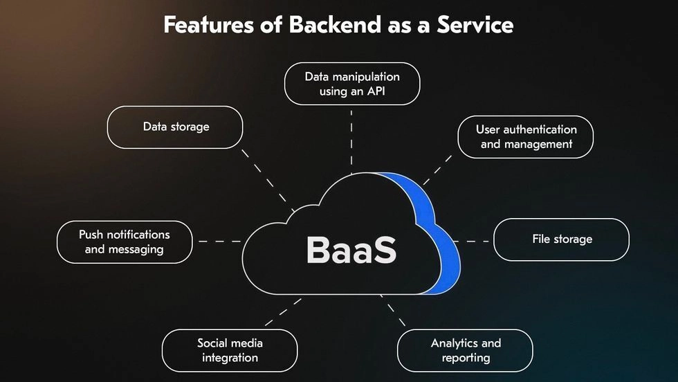
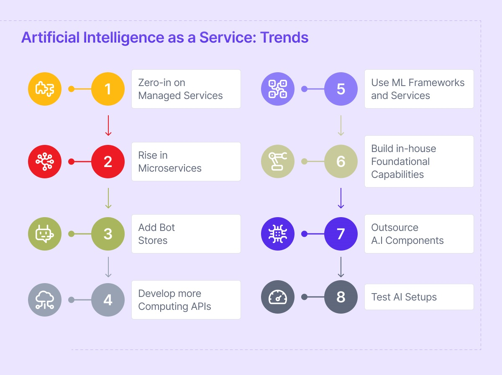

## Questão 1

## Questão 02

#### a. Quais são as seis principais vantagens da computação em nuvem?
1. Trocar despesas de capital por despesas variáveis.
2. Economias de escala maciças.
3. Parar de adivinhar a capacidade.
4. Aumentar a velocidade e agilidade.
5. Foco no que importa.
6. Globalizar-se em minutos.

#### b. Quais são os três modelos de serviços de computação em nuvem? Defina-os brevemente e cite um exemplo para cada modelo, seja de um serviço da AWS ou de outro provedor.
1. IaaS (Infraestrutura como Serviço): Oferece recursos básicos de computação e rede. Você gerencia o SO.
   * Exemplo: Amazon EC2.
2. PaaS (Plataforma como Serviço): Remove a necessidade de gerenciar a infraestrutura subjacente.
   * Exemplo: AWS Elastic Beanstalk.
3. SaaS (Software como Serviço): Produto completo gerenciado pelo provedor.
   * Exemplo: Microsoft 365 ou Salesforce.

#### c.  Cite três serviços da AWS para cada categoria a seguir: Computação, Armazenamento e Banco de Dados.
1. Computação: EC2, Lambda, ECS
2. Armazenamento: S3, EBS, EFS
3. Banco de Dados: RDS, DynamoDB, Redshift

#### d. Quais as três principais maneiras de interagir com a AWS?
* Console de Gerenciamento da AWS, AWS CLI (Interface de Linha de Comando) e AWS SDKs.

#### e. Quais são as seis perspectivas do AWS Cloud Adoption Framework (AWS CAF)? Cite um stakeholder importante para cada perspectiva.
* Negócio: Gerentes de Negócios / Finanças.
* Pessoas: RH / Gerentes de Mudança.
* Governança: CIO / Gerentes de Projetos.
* Plataforma: Arquitetos de Nuvem / Gerentes de TI.
* Segurança: CISO / Analistas de Segurança.
* Operações: Suporte de TI / Gerentes de Operações.

## Questão 03

### BaaS (Backend as a Service)
* É um modelo de serviço em nuvem focado na automação da infraestrutura do lado do servidor. Ele permite que desenvolvedores conectem aplicações web ou móveis a serviços prontos, como sistemas de autenticação, bancos de dados , armazenamento de arquivos e notificações. Ao utilizar APIs e SDKs fornecidos pelo provedor, elimina-se a necessidade de configurar, gerenciar ou escalar servidores físicos ou máquinas virtuais para estas funções.

* Representação:

* Exemplo: Um exemplo comum é o uso do Firebase em aplicações web ou mobile. Nele, o desenvolvedor pode implementar login de usuários, banco de dados em tempo real e armazenamento de arquivos sem precisar desenvolver um backend próprio, apenas integrando os serviços via API.

### AIaaS (Artificial Intelligence as a Service)
* É um modelo de serviço em nuvem que disponibiliza recursos de inteligência artificial prontos para uso, como aprendizado de máquina, processamento de linguagem natural e visão computacional. Ele permite que aplicações integrem funcionalidades inteligentes sem a necessidade de criar e treinar modelos do zero.

* Representação:

* Exemplo: Uma aplicação pode integrar APIs de IA para criar chatbots, sistemas de recomendação ou análise de dados, consumindo serviços prontos oferecidos por plataformas como OpenAI, sem precisar desenvolver modelos do zero.

#### Fontes:
- https://www.cloud4u.com/es-en/news/ai-as-a-service/
- https://dev.to/balakrishnasajja/understanding-backend-as-a-service-baas-2915