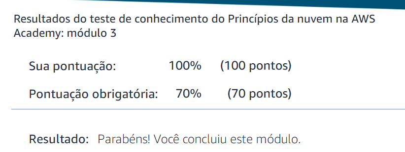

## Questão 1

## Questão 2.1
### Governança de dados, requisitos legais
Dependendo do local, a lei pode exigir que certas informações permaneçam dentro das fronteiras nacionais.

### Proximidade com os clientes (latência)
Para reduzir a latência, é recomendável escolher uma região que esteja mais próxima do usuário.

### Serviços disponíveis na região 
Nem todos os serviços estão disponíveis em todas as regiões, então é muito importante verificar se os serviços que se planeja usar estão disponíveis na região escolhida.

### Custos (variam por Região)
O custo da execução dos serviços varia dependendo da região escolhida.

## Questão 2.2
### América do Norte
- AWS GovCloud (Leste dos EUA): 3 zonas
- AWS GovCloud (Oeste dos EUA): 3 zonas
- Canadá (Central): 3 zonas
- Oeste do Canadá (Calgary): 3 zonas
- México (Centro): 3 zonas
- Oeste dos EUA (Norte da Califórnia): 3 zonas
- Leste dos EUA (Norte da Virgínia): 6 zonas
- Leste dos EUA (Ohio): 3 zonas
- Oeste dos EUA (Oregon): 4 zonas

### América do Sul
- América do Sul (SP): 3 zonas

### Europa
- Europa (Estocolmo): 3 zonas
- Europa (Frankfurt): 3 zonas
- Europa (Irlanda): 3 zonas
- Europa (Londres): 3 zonas
- Europa (Milão): 3 zonas
- Europa (Paris): 3 zonas
- Europa (Espanha): 3 zonas
- Europa (Zurique): 3 zonas
- AWS European Sovereign Cloud (Germany): 3 zonas

### Oriente Médio
- Oriente Médio (Bahrein): 3 zonas
- Reino da Arábia Saudita | Em breve: 3 zonas 
- Israel (Tel Aviv): 3 zonas
- Oriente Médio (EAU): 3 zonas

### África
- África (Cidade do Cabo): 3 zonas

### Ásia-Pacífico
- Mainland China (Beijing) | Em breve: 3 zonas
- Ásia-Pacífico (Hong Kong): 3 zonas
- Ásia-Pacífico (Hyderabad): 3 zonas
- Ásia-Pacífico (Jacarta): 3 zonas
- Ásia-Pacífico (Malásia): 3 zonas
- Ásia-Pacífico (Mumbai): 3 zonas
- Mainland China (Ningxia) | Em breve: 3 zonas
- Ásia-Pacífico (Osaka): 3 zonas
- Ásia-Pacífico (Seul): 4 zonas
- Ásia-Pacífico (Taipei): 3 zonas
- Ásia-Pacífico (Tailândia): 3 zonas
- Ásia-Pacífico (Tóquio): 4 zonas
- Ásia-Pacífico (Singapura): 3 zonas

### Austrália e Nova Zelândia
- Austrália (Melbourne): 3 zonas
- Austrália (Sydney): 3 zonas
- ASia Pacific (New Zealand): 3 zonas

## Questão 4

### Armazenamento

- **Amazon S3**  
  Serviço de armazenamento de objetos que oferece escalabilidade, disponibilidade de dados, segurança e performance.  
  Link: https://docs.aws.amazon.com/s3/?icmpid=docs_homepage_storage  

- **AWS Backup**  
  Serviço de backup totalmente gerenciado que facilita a centralização e a automatização do backup de dados em todos os serviços da AWS, tanto na nuvem quanto em ambientes locais.  
  Link: https://docs.aws.amazon.com/aws-backup/?icmpid=docs_homepage_storage  

- **AWS Snollball Edge**  
  Ajudam os clientes que precisam executar operações fora de data centers e em locais sem conectividade de rede consistente.  
  Link: https://docs.aws.amazon.com/snowball/?icmpid=docs_homepage_storage  

### Computação

- **AWS Lambda**  
  Executar código sem provisionar ou gerenciar servidores.  
  Link: https://docs.aws.amazon.com/lambda/?icmpid=docs_homepage_compute  

- **AWS Wavelength**  
  Permite que desenvolvedores criem aplicativos que oferecem latência ultrabaixa para dispositivos móveis e usuários finais.  
  Link: https://docs.aws.amazon.com/wavelength/?icmpid=docs_homepage_compute  

- **AWS Batch**  
  Permite executar cargas de trabalho de computação em lote na Nuvem AWS.  
  Link: https://docs.aws.amazon.com/batch/?icmpid=docs_homepage_compute  

### Banco de Dados

- **Amazon Neptune**  
  Serviço de banco de dados de grafos rápido, confiável e totalmente gerenciado que facilita a criação e a execução de aplicativos que trabalham com conjuntos de dados altamente conectados.  
  Link: https://docs.aws.amazon.com/neptune/?icmpid=docs_homepage_databases  

- **Amazon Timestream**  
  Armazenar e analisar facilmente dados de sensores para aplicações de IoT, métricas para casos de uso de DevOps e telemetria para cenários de monitoramento de aplicações.  
  Link: https://docs.aws.amazon.com/timestream/?icmpid=docs_homepage_databases  

- **Amazon DynamoDB**  
  Serviço de banco de dados NoSQL totalmente gerenciado que oferece desempenho rápido e previsível.  
  Link: https://docs.aws.amazon.com/dynamodb/?icmpid=docs_homepage_databases  

### Rede e Entrega de Conteúdo

- **Amazon API Gateway**  
  Permite que criar e implementar suas próprias APIs REST e WebSocket em qualquer escala.  
  Link: https://docs.aws.amazon.com/apigateway/?icmpid=docs_homepage_networking  

- **AWS App Mesh**  
  Facilita o monitoramento e o controle de microsserviços em execução na AWS.  
  Link: https://docs.aws.amazon.com/app-mesh/?icmpid=docs_homepage_networking  

- **Amazon CloudFront**  
  Acelera a distribuição do seu conteúdo web estático e dinâmico, como arquivos .html, .css, .php, imagens e mídias.  
  Link: https://docs.aws.amazon.com/cloudfront/?icmpid=docs_homepage_networking  
